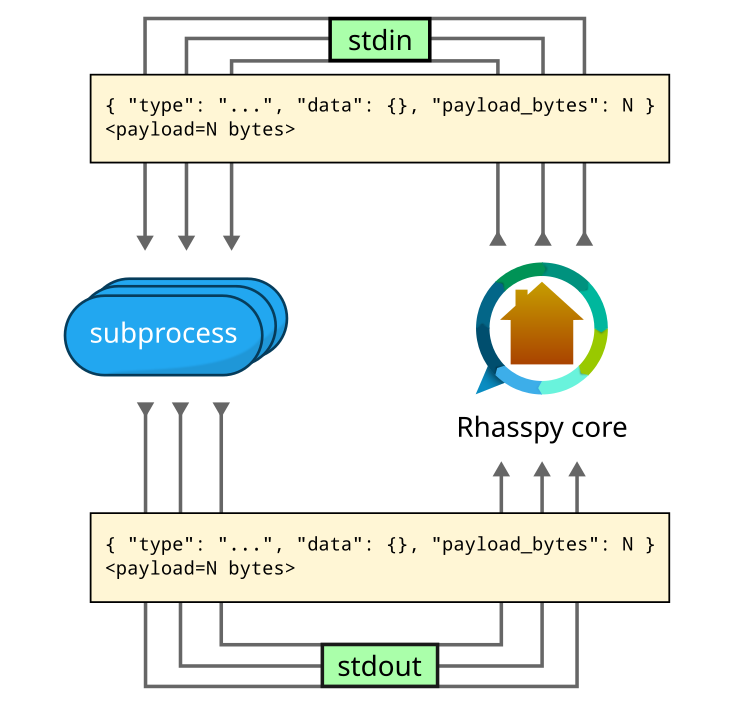
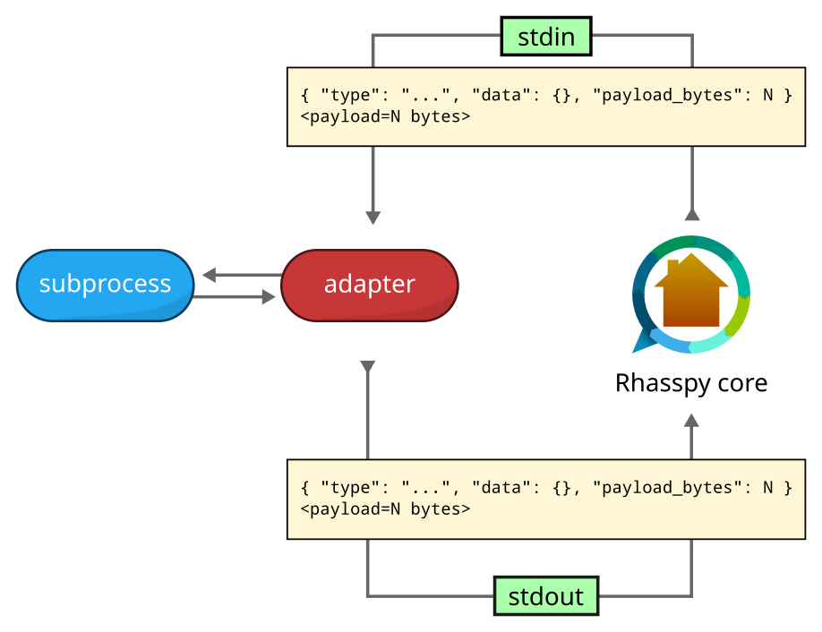

# The Wyoming Protocol

An interprocess event protocol over stdin/stdout for Rhasspy v3.

(effectively [JSONL](https://jsonlines.org/) with an optional binary payload)




## Motivation

Rhasspy v2 was built on top of MQTT, and therefore required (1) an MQTT broker and (2) all services to talk over MQTT. Each open source voice program needed a custom service wrapper to talk to Rhasspy.

For v3, a project goal was to minimize the barrier for programs to talk to Rhasspy.


## Talking Directly to Programs

Many voice programs have similar command line interfaces. For example, most text to speech programs accept text through standard input and write a WAV file to standard output or a file:

```sh
echo “Input text” | text-to-speech > output.wav
```

A protocol based on standard input/output would be universal across languages, operating systems, etc. However, some voice programs need to consume or produce audio/event streams. For example, a speech to text system may return a result much quicker if it can process audio as it's being recorded.

## Event Streams

Standard input/output are byte streams, but they can be easily adapted to event streams that can also carry binary data. This lets us send, for example, chunks of audio to a speech to text program as well as an event to say the stream is finished. All without a broker or a socket!

Each **event** in the Wyoming protocol is:

1. A **single line** of JSON with an object:
    * **MUST** have a `type` field with an event type name
    * MAY have a `data` field with an object that contains event-specific data
    * MAY have a `payload_length` field with a number > 0
2. If `payload_length` is given, *exactly* that may bytes follows

Example:

```json
{ "type": "audio-chunk", "data": { "rate": 16000, "width", "channels": 1 }, "payload_length": 2048 }
<2048 bytes>
```


## Adapter

Using events over standard input/output unfortunately means we cannot talk to most programs directly. Fortunately, [small adapters](adapters.md) can be written and shared for programs with similar command-line interfaces. The adapter speaks events to Rhasspy, but calls the underlying program according to a common convention like “text in, WAV out”.



## Events Types

Voice programs vary significantly in their options, but programs within the same [domain](domains.md) have the same minimal requirements to function:

* mic
    * Audio input
    * Outputs fixed-sized chunks of PCM audio from a microphone, socket, etc.
    * Audio chunks may contain timestamps
* wake
    * Wake word detection
    * Inputs fixed-sized chunks of PCM audio
    * Outputs name of detected model, timestamp of audio chunk
* asr
    * Speech to text
    * Inputs fixed-sized chunks of PCM audio
    * Inputs an event indicating the end of the audio stream (or voice command)
    * Outputs a transcription
* vad
    * Voice activity detection
    * Inputs fixed-sized chunks of PCM audio
    * Outputs events indicating the beginning and end of a voice command
* intent
    * Intent recognition
    * Inputs text
    * Outputs an intent with a name and entities (slots)
* handle
    * Intent/text handling
    * Does something with an intent or directly with a transcription
    * Outputs a text response
* tts
    * Text to speech
    * Inputs text
    * Outputs one or more fixed-sized chunks of PCM audio
* snd
    * Audio output
    * Inputs fixed-sized chunks of PCM audio
    * Plays audio through a sound system

The following event types are currently defined:

| Domain | Type           | Data                             | Payload |
|--------|----------------|----------------------------------|---------|
| audio  | audio-start    | timestamp, rate, width, channels |         |
| audio  | audio-chunk    | timestamp, rate, width, channels | PCM     |
| audio  | audio-stop     | timestamp                        |         |
| wake   | detection      | name, timestamp                  |         |
| wake   | not-detected   |                                  |         |
| vad    | voice-started  | timestamp                        |         |
| vad    | voice-stopped  | timestamp                        |         |
| asr    | transcript     | text                             |         |
| intent | recognize      | text                             |         |
| intent | intent         | name, entities                   |         |
| intent | not-recognized | text                             |         |
| handle | handled        | text                             |         |
| handle | not-handled    | text                             |         |
| tts    | synthesize     | text                             |         |
| snd    | played         |                                  |         |
